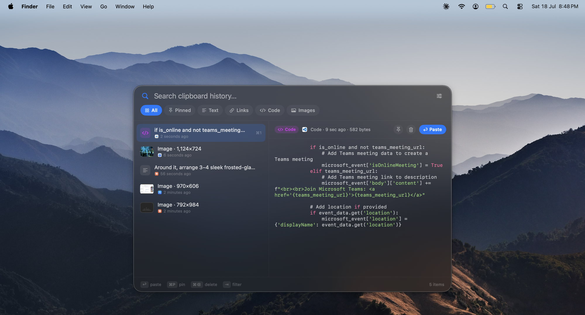

# Clipboard

A fast, beautiful, keyboard-first clipboard history manager for macOS. Native Swift + SwiftUI, zero dependencies, ~650 KB app, 0% idle CPU.

<p align="center">
  
</p>

## Open it

**⌘⇧V** from anywhere — a Spotlight-style floating panel appears over whatever you're doing. Or click the clipboard icon in the menu bar (right-click it for a menu: pause, launch at login, quit).

## What it does

- **Everything you copy is captured**: text, images (with previews), links, files, code, hex colors — each auto-classified with its own look.
- **Code gets syntax highlighting** in the list, colors get a live swatch, images get thumbnails.
- **Duplicates coalesce** — copying the same thing again shows one entry with "copied N×" and bumps it to the top.
- **Pin** anything you always want around (⌘P) — pinned items float to the top and survive history pruning.
- **Search** — just start typing. Filters by content and source app.
- **Filter tabs** — All / Pinned / Text / Links / Code / Images. Press **Tab** to cycle.
- **Source tracking** — every item remembers which app it came from and when.
- **100% local.** SQLite in `~/Library/Application Support/Clipboard/`. Nothing ever leaves your Mac. Password manager content marked transient/concealed is never recorded.

## Keyboard reference

| Key | Action |
|---|---|
| ⌘⇧V | Open / close the panel (global) |
| type | Search |
| ↑ ↓ | Move selection |
| ↩ | Paste selected item |
| ⌘1–⌘9 | Paste the Nth item instantly |
| ⌘P | Pin / unpin |
| ⌘C | Copy to clipboard without pasting |
| ⌘⌫ | Delete item |
| Tab / ⇧Tab | Cycle filter tabs |
| Esc | Dismiss |

## Auto-paste

By default, choosing an item pastes it straight into the app you were using. This needs **Accessibility** permission (System Settings → Privacy & Security → Accessibility) — use the panel's ⚙ menu → "Grant Accessibility Access…". Without it, items are still copied to the clipboard; you just press ⌘V yourself.

## Why it's light on your machine

- Pure Swift/AppKit/SwiftUI compiled to native code — no Electron, no web runtime.
- The clipboard poll is a single integer comparison every ~0.5 s on a tolerance-enabled timer, so macOS coalesces wakeups and the CPU stays asleep (measured: 0.0% CPU, <0.3 s total CPU time per hour idle).
- The panel UI isn't even created until the first time you open it.
- Images live on disk, not in RAM; the list shows downsampled thumbnails through a size-capped cache.
- History is pruned to the most recent 500 unpinned items automatically.

## Building

Open `clipboard.xcodeproj` in Xcode and run, or:

```sh
xcodebuild -project clipboard.xcodeproj -scheme clipboard -configuration Release build
```

To keep it running day-to-day, copy the built `clipboard.app` to `/Applications` and enable "Launch at Login" from the menu bar icon's right-click menu.
